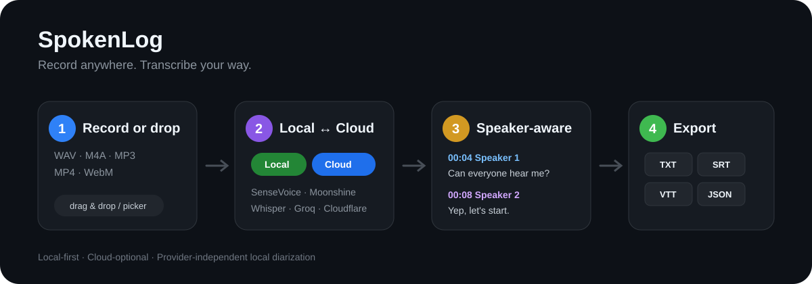

# SpokenLog

**Record it. Know what was said.**

SpokenLog is a local-first, cloud-optional recorder and transcription app. The name is literal: a log of spoken words, not the name of a speech model or AI technology. Record directly, drop in an existing audio/video file, switch between local and cloud STT, add speaker labels locally, and export the result without being locked to one transcription engine.



> Pre-release project. User-facing version numbers are intentionally not shown yet.

## What makes SpokenLog different

SpokenLog is built as a **recording library first, transcription tool second**. It is for people who want to keep everyday recordings organized and searchable without committing to one AI provider.

- **One library for recording and transcription** — record, import, rename, organize into collections, favorite, search transcript text, browse by calendar, and recover deleted items.
- **Native mobile direction** — Android is a first-class target rather than a phone remote for a desktop transcriber.
- **Choose per device and situation** — stay fully local when privacy matters, or use your own Groq / Cloudflare credentials when cloud speed is more useful.
- **Provider-independent speaker workflow** — local diarization can sit on top of supported local or cloud STT results, and speaker names plus transcript text remain editable afterward.
- **No fake quota meter** — when a provider does not expose authoritative remaining usage, SpokenLog says so instead of inventing a number.
- **Crash-aware recording storage** — active recordings checkpoint metadata periodically and interrupted WAV sessions are recovered on the next launch when possible.
- **Batch without parallel chaos** — import multiple files and process selected recordings through a sequential transcription queue.

If this workflow is useful to you, a GitHub star helps other people discover the project.

## Why SpokenLog

- **Local ↔ Cloud without lock-in** — switch between SenseVoice, Moonshine, local Whisper, Groq, and Cloudflare.
- **Speaker diarization stays local** — pyannote segmentation + 3D-Speaker embeddings run on-device as a provider-independent post-process.
- **Drag, drop, transcribe** — import WAV, M4A, MP3, MP4, or WebM instead of recording everything again.
- **Useful exports** — save speaker-aware transcripts as TXT, SRT, VTT, or JSON.
- **Usage visibility** — show what the app can reliably track for cloud free-tier usage and point users to the provider dashboard when exact remaining quota is unavailable.
- **No subscription required** — local transcription has no usage quota; cloud providers are optional.

## 10-second workflow

1. Record in SpokenLog or drag an existing file onto the app.
2. Choose **Local** for privacy/offline use or **Cloud** for speed and stronger large-model accuracy.
3. Optionally enable **Local speaker diarization**.
4. Click a timestamp to review the audio, correct transcript segments or speaker names, then copy or export TXT/SRT/VTT/JSON.

### Imported files

| Format | Local STT | Cloud STT |
| --- | --- | --- |
| WAV | Yes | Yes |
| M4A / MP3 / MP4 / WebM | Not yet | Yes* |

`* Large non-WAV files above the current cloud upload chunk limit are not automatically split yet.`

Imported files are copied into SpokenLog's library. The original file is not modified or moved.

## Transcription engines

### Cloud

- **Groq** — Whisper Large V3 / Large V3 Turbo. Fast multilingual cloud transcription.
- **Cloudflare Workers AI** — Whisper Large V3 Turbo. Separate Workers AI free-tier capacity.

### Local

- **SenseVoiceSmall INT8** — fast local transcription for Korean, English, Chinese, Japanese, and Cantonese; includes timestamps.
- **Moonshine Tiny KO** — ~69MB lightweight Korean-only local model.
- **Whisper Tiny Multilingual INT8** — ~104MB general multilingual local fallback.

OpenAI's paid API is not included as a default provider because the project is built around free-first and local-first usage.

## Local speaker diarization

Speaker diarization is separate from STT and runs locally after transcription.

- sherpa-onnx Offline Speaker Diarization
- pyannote segmentation + 3D-Speaker embedding + clustering
- ~42MB additional models
- automatic speaker count or manual 2–8 speaker selection
- audio is not uploaded for diarization
- diarization currently requires WAV input
- shared across Groq, Cloudflare, SenseVoice, and Local Whisper results with timestamped segments
- Moonshine currently has no detailed timestamp segments, so speaker labels are skipped for it

The labels identify `Speaker 1`, `Speaker 2`, etc. within the recording. They do not identify a person's real-world identity.

## Languages

The transcription language is selected independently from the engine.

Automatic detection plus Korean, English, Japanese, Chinese/Cantonese, Spanish, French, German, Portuguese, Italian, Russian, Arabic, Hindi, Vietnamese, Ukrainian, Indonesian, Thai, Turkish, Dutch, and Polish are available. Engines that do not support the selected language are disabled in settings.

## Platform support

- **Windows** — primary desktop target. Release builds are part of CI validation.
- **Android** — primary mobile target. Responsive UI, native file picking, microphone permissions, and foreground-recording integration are implemented; native APK validation is still part of the pre-release work.
- **macOS / iOS** — planned. The shared Flutter code is designed with these platforms in mind, but they are not yet officially supported or build/device-tested.
- **Linux / Web** — not current release targets.

## Responsive UI

- **Phone (<600 px)** — stacked status header, full-width import/record actions, compact recording menus, wrapping transcript actions, near-full-screen settings.
- **Tablet / compact desktop** — two-row controls with the active engine still visible.
- **Desktop** — single-row toolbar, drag-and-drop import, and split library/detail workspace.
- File drag-and-drop is enabled only on desktop; mobile uses the native file picker.

## Recording and library

- Windows and Android are the current first-release targets
- start / pause / resume / stop recording
- new recordings stored as one 16 kHz mono WAV
- interactive WAV waveform
- playback, seek, and speed control
- timestamp click-to-seek
- desktop library/sidebar + detail workspace
- rename, transcript editing, custom speaker names, search, reveal file location, delete confirmation
- API credentials stored in OS secure storage
- local model download/delete management
- fallback to another usable engine when a provider hits a recoverable error

## Export formats

- **TXT** — readable timestamp + speaker labels when segments exist
- **SRT** — subtitle timestamps with speaker labels
- **VTT** — WebVTT subtitle output
- **JSON** — structured transcript and segment metadata

## Cloud usage display

### Groq

SpokenLog tracks successful audio duration used through this app and captures request-quota headers when Groq returns them.

Groq does not expose the account's exact remaining ASH/ASD audio quota in the transcription response headers, so SpokenLog does **not** pretend to know it. Usage from other apps, devices, or older versions is also outside the app's local counter. For the authoritative value, use **Groq Console → Settings → Limits**.

### Cloudflare

SpokenLog estimates the Workers AI usage generated by this app using the published Whisper Large V3 Turbo neuron rate. The Workers AI daily quota is shared with other Workers AI models and apps, which SpokenLog cannot see.

## Storage

```text
recordings/
  recording_20260919_183000/
    session.json
    recording.wav
    transcript.txt
    transcript.json

  import_20260920_120000_123456/
    session.json
    imported.mp3
    transcript.txt
    transcript.json
```

Large WAV cloud uploads are split only into temporary WAV chunks during transcription and cleaned up afterward. The original recording remains a single file.

## Build validation

GitHub Actions validates the shared Flutter code with dependency resolution, static analysis, and tests. Windows release builds are part of the main build path, while Android debug APK compilation is used as a mobile smoke check during pre-release development.

```text
flutter pub get
flutter analyze
flutter test
flutter build apk --debug
flutter build windows --release
```

Windows is the currently verified desktop release target. Android is a first-release target, but native APK validation is still being finalized. macOS and iOS are not yet included in official build validation.

## Security

- API keys are never committed to the source repository.
- Cloud transcription uploads audio only when the user explicitly starts transcription.
- Local STT and local speaker diarization do not send the recording to an external transcription service.


## License

SpokenLog is free and open-source software licensed under the **GNU Affero General Public License v3.0 only (AGPL-3.0-only)**.

You may use, study, modify, distribute, and use the software commercially under the terms of the AGPLv3. If you modify SpokenLog and make that modified version available to users over a network, the AGPL's network-source requirement applies: those users must be offered access to the corresponding source code for the version they are using.

See [LICENSE](LICENSE) for the complete license text.

The software license does not grant rights to present an unofficial fork or service as the official **SpokenLog** project. See [TRADEMARKS.md](TRADEMARKS.md) for the project branding policy.
