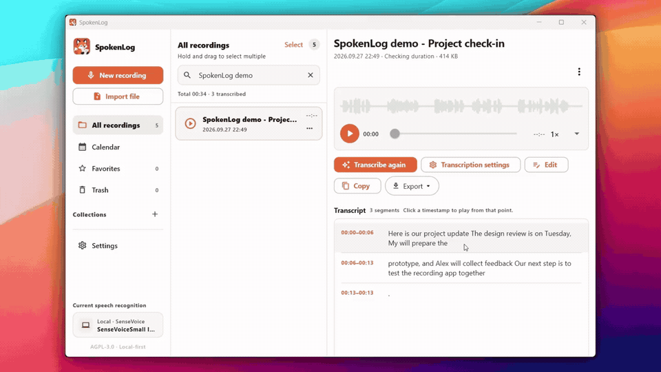

# SpokenLog

Record audio or import a file, transcribe it, and export the text.

https://github.com/user-attachments/assets/cf12c70e-a913-4209-887f-9ed36139ffa6

GIF preview

The demo uses an unreleased local build with Windows crash, translation and Settings fixes. Downloads below are still build 7. [Known issues](docs/installation.md#known-issues).

## Download

[v0.1.0, build 7](https://github.com/Blue-B/SpokenLog/releases/tag/v0.1.0). Test packages, not store releases. Repository access is required while this project is private.

| Platform | Download | Note |
| --- | --- | --- |
| Android 7.0+ | [APK](https://github.com/Blue-B/SpokenLog/releases/download/v0.1.0/SpokenLog-Android.apk) | Development-signed |
| Windows x64 | [Installer](https://github.com/Blue-B/SpokenLog/releases/download/v0.1.0/SpokenLog-Windows-x64-Setup.exe) / [ZIP](https://github.com/Blue-B/SpokenLog/releases/download/v0.1.0/SpokenLog-Windows-x64.zip) | Unsigned; see known issues |
| macOS 12+ | [ZIP](https://github.com/Blue-B/SpokenLog/releases/download/v0.1.0/SpokenLog-macOS.zip) | Not notarized |
| iOS / iPadOS 15+ | [Unsigned IPA](https://github.com/Blue-B/SpokenLog/releases/download/v0.1.0/SpokenLog-iOS-unsigned.ipa) | Re-signing required; not tap-to-install |

Back up important recordings before updating. [Installation guide](docs/installation.md) | [Checksums](https://github.com/Blue-B/SpokenLog/releases/download/v0.1.0/SHA256SUMS.txt)

## Features

- Recording library with search, collections, favorites and timestamped playback.
- Local SenseVoice, Moonshine or Whisper; cloud transcription with your own Groq or Cloudflare credentials.
- Transcript editing, local speaker labels, and TXT, SRT, VTT or JSON export.

Local transcription keeps audio on your device and currently requires WAV. Cloud transcription uploads audio to the selected provider. The interface supports English and Korean; spoken-language support depends on the engine.

## Documentation

[Features and formats](docs/features.md) | [Build from source](docs/development.md) | [Data management and removal](docs/desktop-removal.md) | [Release notes](docs/releases/v0.1.0.md)

[AGPL-3.0-only](LICENSE) | [Branding policy](TRADEMARKS.md)
